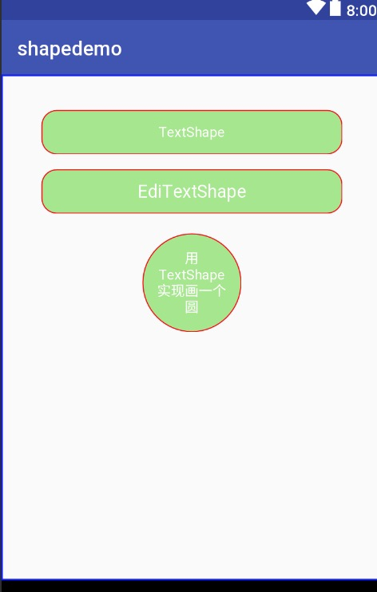
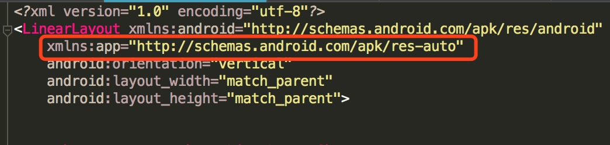
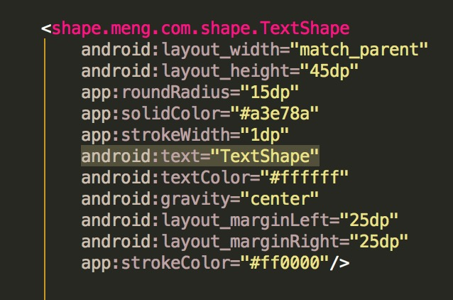
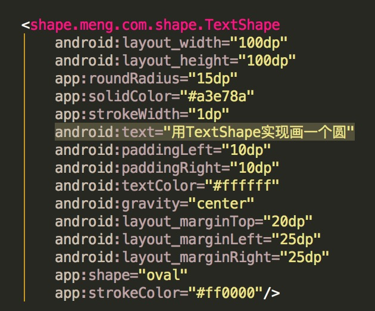
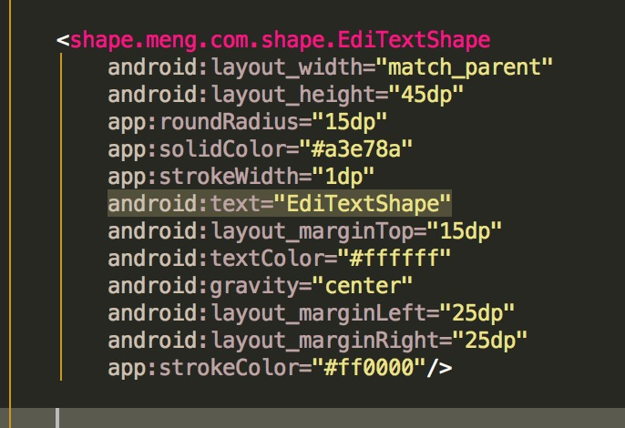

# shapewidget
减少创建shape文件  
用法   项目的build.gradle添加  
allprojects{  
		repositories{  
			maven { url 'https://www.jitpack.io' }  
		}  
	}     
  
  然后引入dependencies{  
	        implementation 'com.github.mengyueyao:shapewidget:1.2.1'  
	}  
  
 目前只有三个简单 TextShape   EdiTextShape 和 LinerLayoutShape 用法也简单，只是基础的，目的在于减少创建drawable的shape文件  
 
   
 
 用法  
 
      

TextShape  

    

TextShape 圆形  

 
 
EditextShape

  

LinearLayoutShape的用法一样，这里不写了

